# Meeting Router - Complete Pipeline Workflow

## 🔄 End-to-End Processing Pipeline

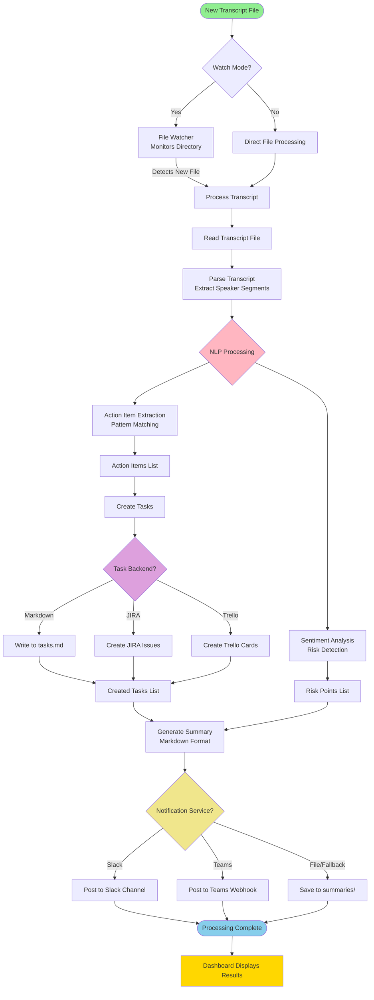

---

## 📊 Detailed Component Workflow

### 1. File Watching & Ingestion

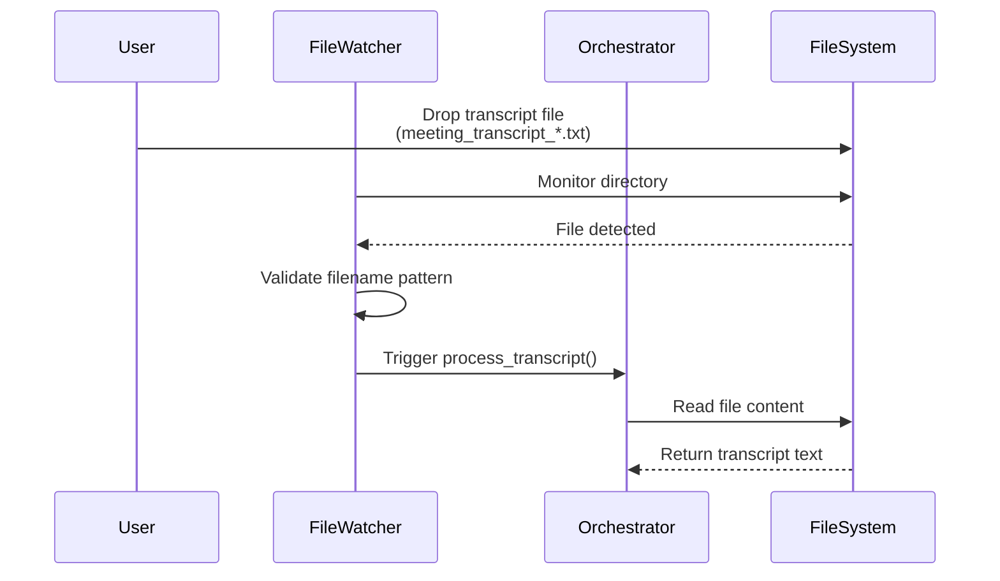

**Key Points:**
- Watches configured directory (default: `./transcripts`)
- Only processes files matching pattern: `meeting_transcript_*.txt`
- Triggers processing automatically on new file detection
- Can also process single files directly via CLI

---

### 2. Transcript Parsing

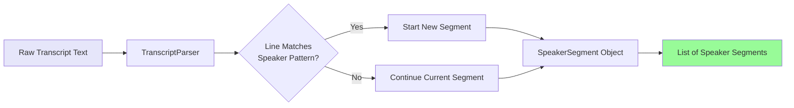

**Pattern Recognition:**
```
Speaker Name: Dialogue text here.
```

**Output Structure:**
```python
SpeakerSegment(
    speaker="John Doe",
    text="I will complete the report by Friday",
    start_position=125
)
```

---

### 3. NLP Processing Pipeline

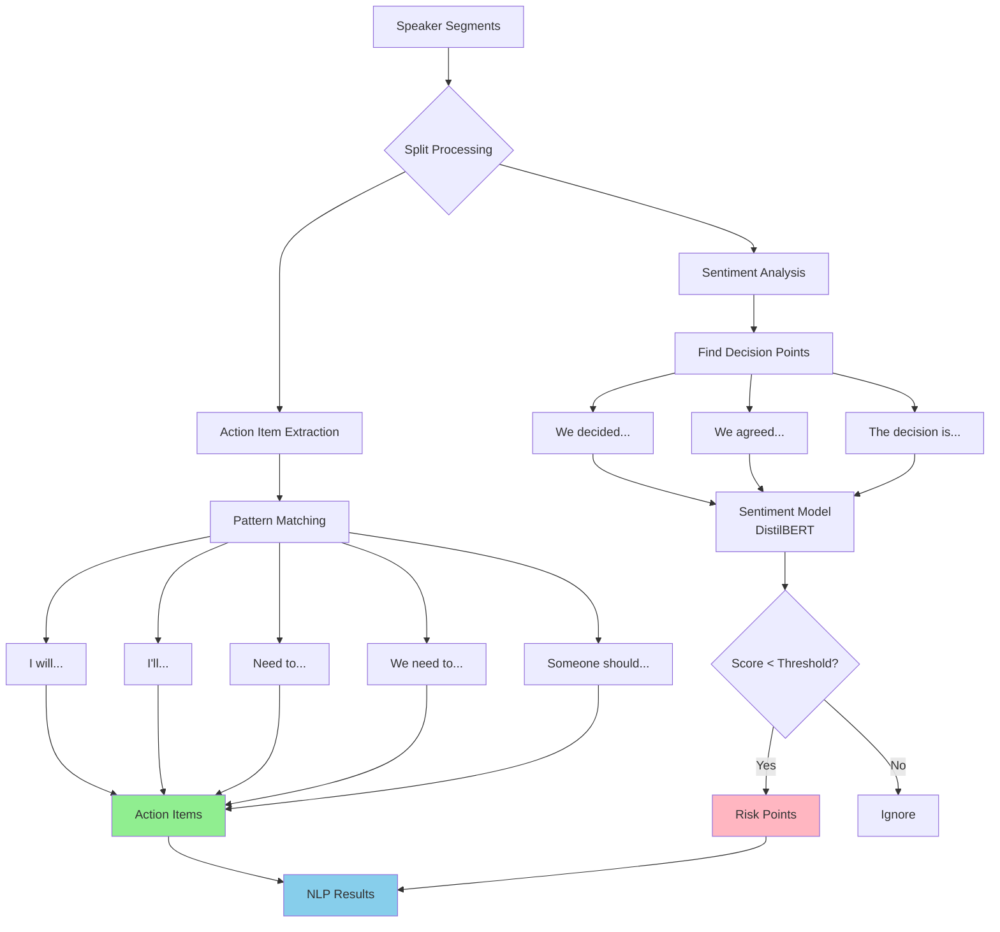

**Action Item Extraction:**
- Uses regex pattern matching
- Identifies commitment phrases
- Extracts owner, task description, and context

**Sentiment Analysis:**
- Identifies decision points in transcript
- Analyzes surrounding context (±2 sentences)
- Uses DistilBERT model for sentiment scoring
- Flags decisions with negative sentiment as risks

---

### 4. Task Creation Flow

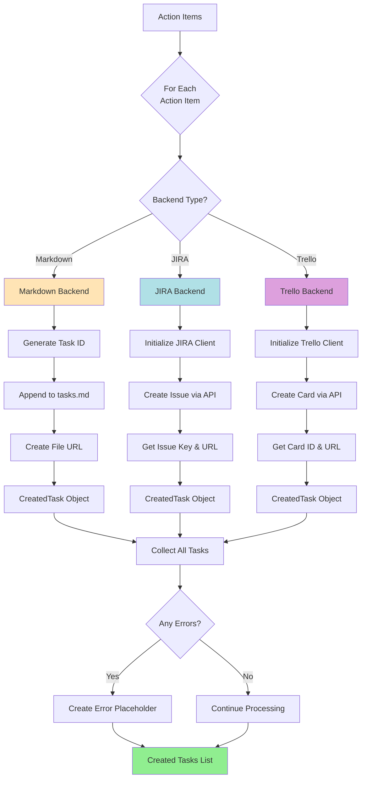

**Error Handling:**
- If task creation fails, creates placeholder with "ERROR" ID
- Processing continues for remaining tasks
- Errors logged but don't stop pipeline

---

### 5. Summary Generation

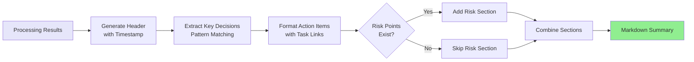

**Summary Structure:**
```markdown
# Meeting Summary - 2024-12-05 14:30:00

## Key Decisions
- Decided to use PostgreSQL for the database

## Action Items
- **John Doe**: Complete the API integration
  - [task_20241205_143000](file://tasks.md#task_20241205_143000)
  - Context: "I will complete the API integration by Friday"

## 🚨 Risk Points for Review
- **Sentiment Score: 0.25**
  - "we decided to use PostgreSQL"
  - Context: Discussion showed concerns about migration
```

---

### 6. Notification & Storage

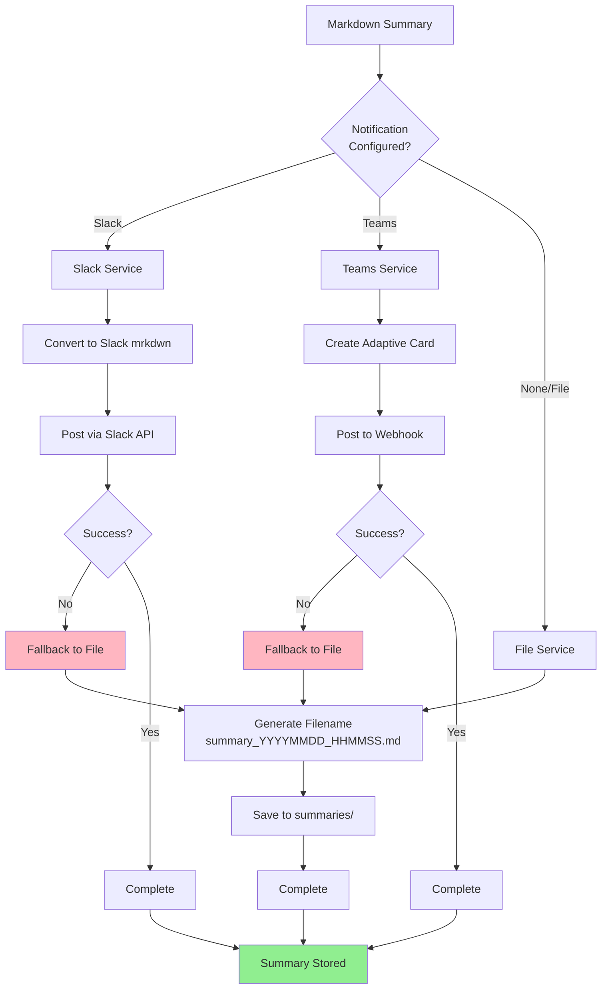

**Retry Logic:**
- 3 retry attempts with exponential backoff (1s, 2s, 4s)
- Automatic fallback to file storage on failure
- Ensures no data loss

---

### 7. Dashboard Display

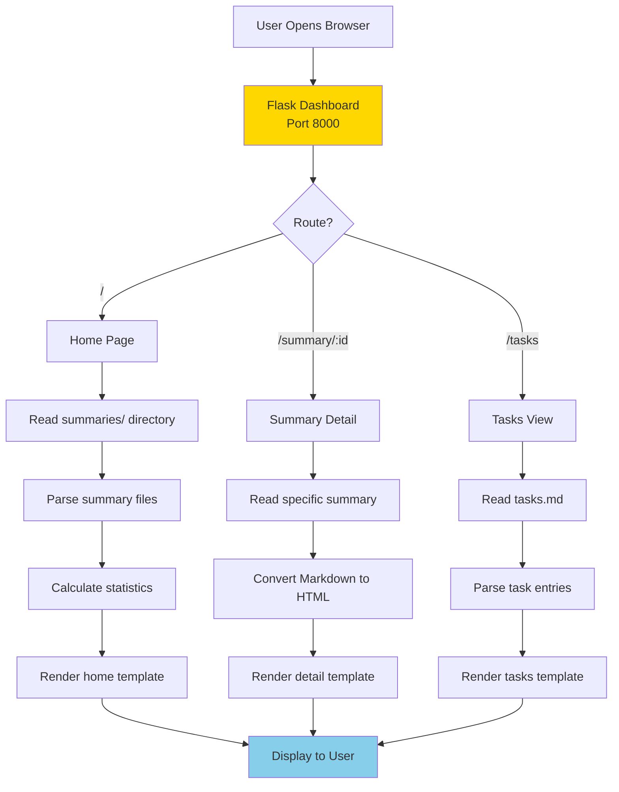

**Dashboard Features:**
- **Statistics Cards**: Total meetings, action items, tasks, risks
- **Summary List**: All processed meetings with timestamps
- **Detail View**: Full formatted summary with Markdown rendering
- **Tasks View**: Table of all created tasks

---

## 🔍 Data Flow Diagram

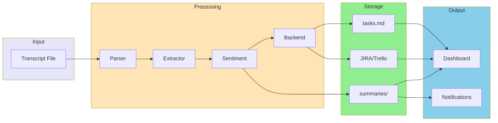

---

## ⚙️ Configuration Flow

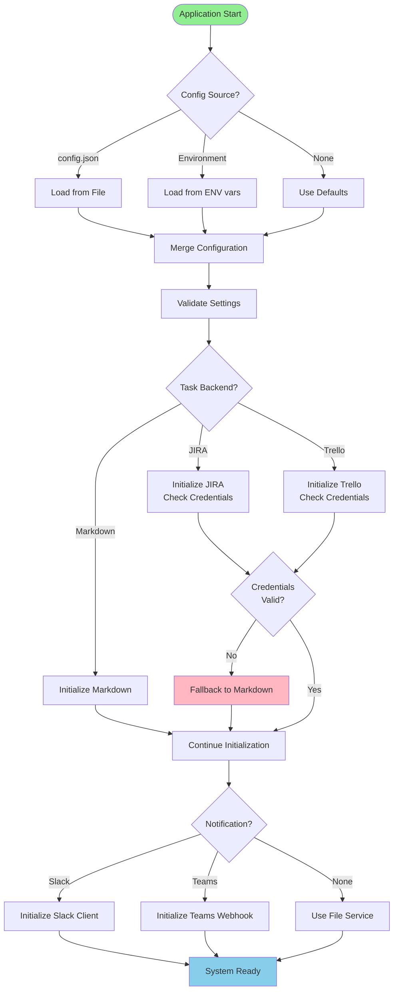

---

## 🎯 Complete System Architecture

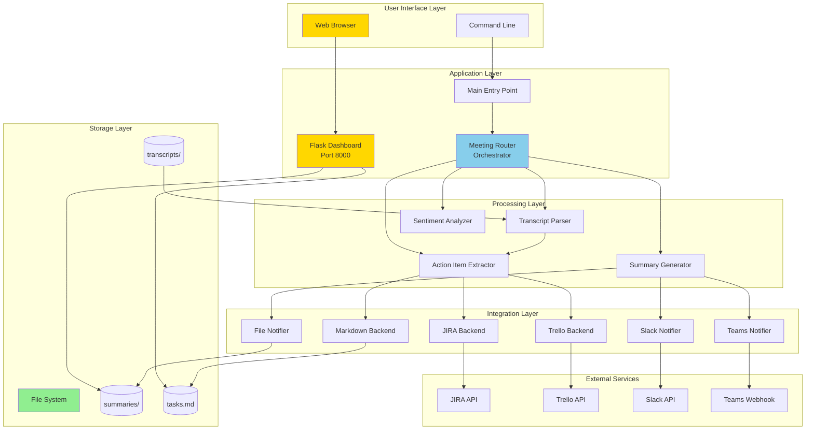

---

## 📝 Processing States

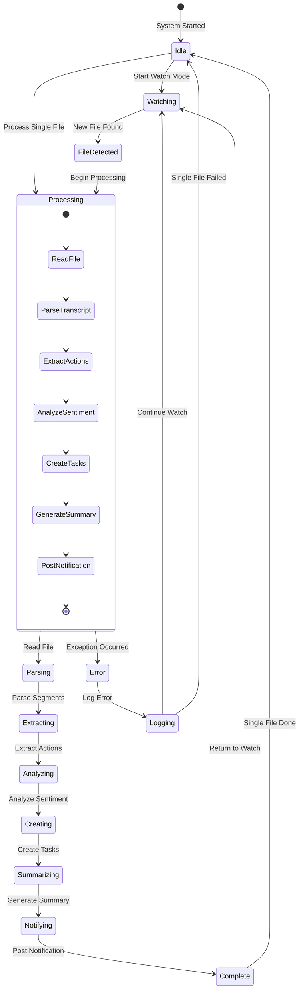

---

## 🚦 Error Handling Flow

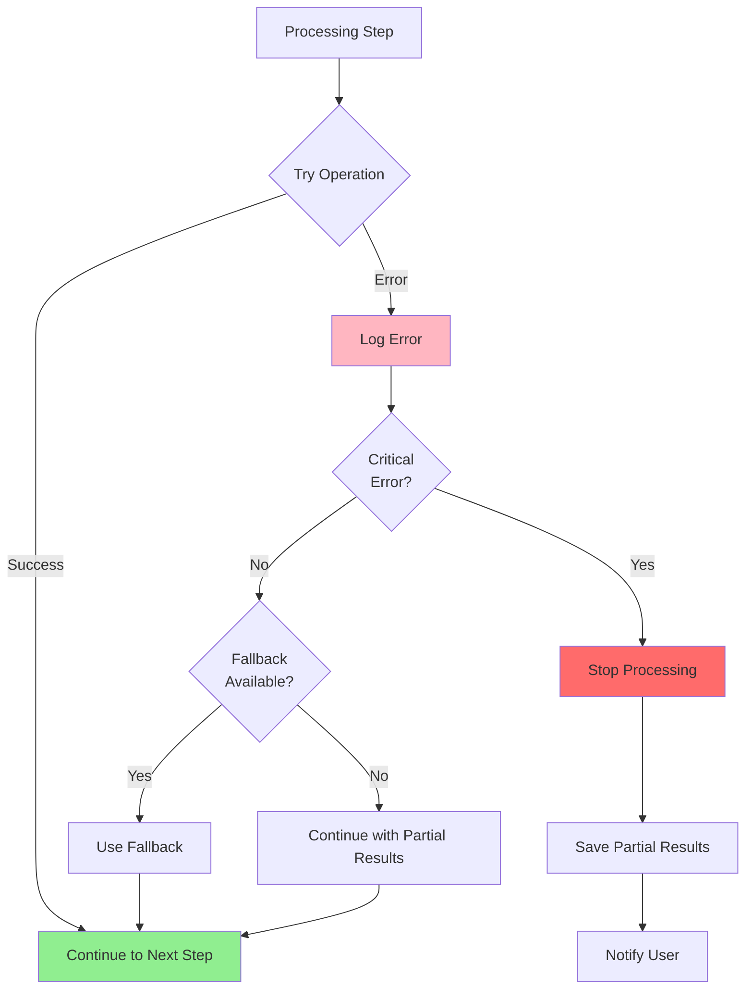

**Error Handling Strategy:**
- **Non-Critical Errors**: Log and continue (e.g., single task creation failure)
- **Critical Errors**: Stop processing, save state, notify user
- **Fallback Mechanisms**: Markdown backend, file notifications
- **Retry Logic**: 3 attempts with exponential backoff for API calls

---

## 📊 Performance Metrics

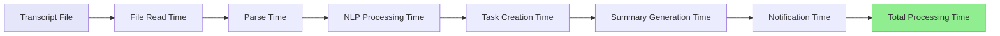

**Typical Processing Times:**
- File Read: < 100ms
- Parsing: 100-500ms
- NLP Processing: 1-3 seconds (sentiment model)
- Task Creation: 100ms-2s (depends on backend)
- Summary Generation: < 100ms
- Notification: 500ms-2s (API calls)

**Total**: ~3-8 seconds per transcript

---

## 🔄 Watch Mode Lifecycle

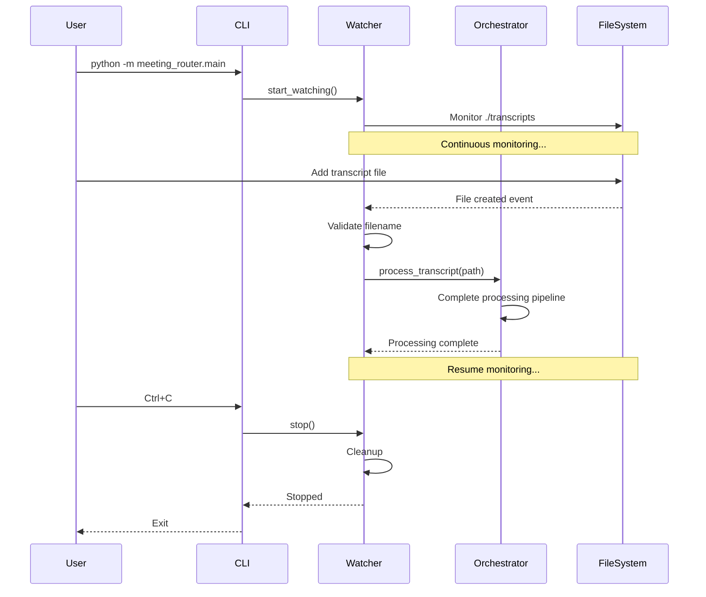

---

## 🎯 Quick Reference

### Input
- **Format**: Text file with speaker labels
- **Pattern**: `meeting_transcript_*.txt`
- **Location**: `./transcripts/` directory

### Processing
- **Parser**: Extracts speaker segments
- **Extractor**: Identifies action items (8 patterns)
- **Analyzer**: Detects risks (sentiment < threshold)

### Output
- **Tasks**: Markdown file, JIRA issues, or Trello cards
- **Summary**: Markdown file in `./summaries/`
- **Notifications**: Slack, Teams, or file

### Access
- **Dashboard**: http://localhost:8000
- **Logs**: `meeting_router.log`
- **Tasks**: `tasks.md`

---

## 🔧 Customization Points

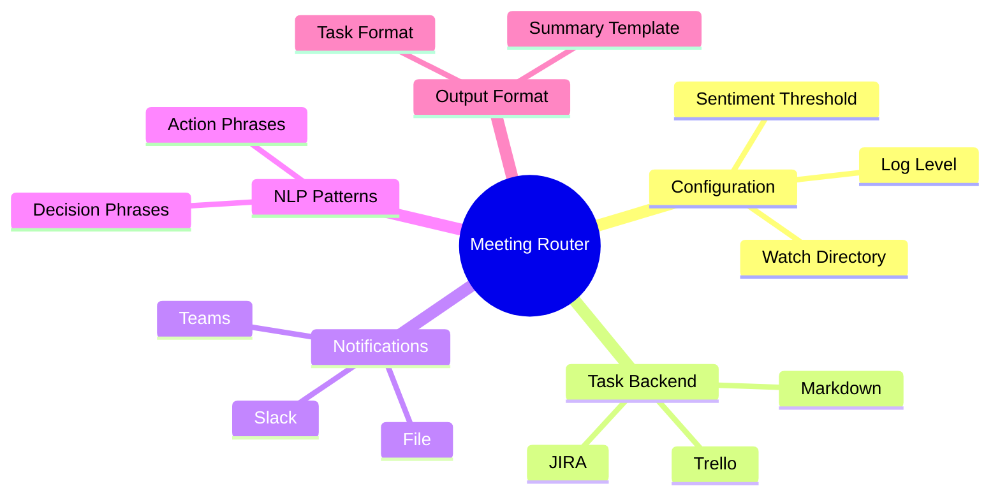

